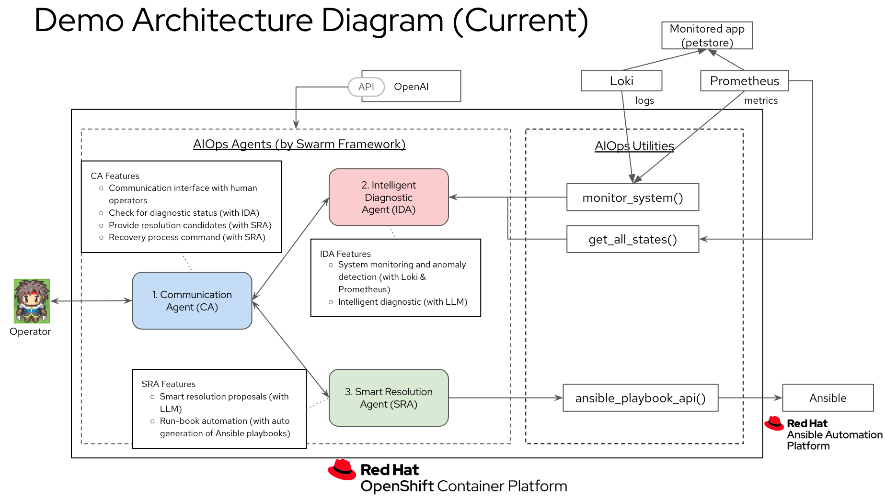

# aiops-agents

<div align="center">

</div>
<br/>


## Overview Presentation
* [AIOps Agents Demo Overview](https://docs.google.com/presentation/d/1yzUVn5qyN946VpEl6n_-U6mqS2nr79TUFAW-EZ3WgHs/edit#slide=id.g30c26c6bc38_1_2303)

## Prerequisite
* OpenShift CLI
* Python 3.13 or higher (recommended)
* OPENAI API KEY
* Ansible Automation Contoroller Subscription Maniferst

## RHDP 
AWS with OpenShift Open Environment
* OpenShift Version: 4.17
* Control Plane Count: 3
* Control Plane Instance Type: m6a.xlarge
* Compute Instance Count: 3
* Compute Instance Type: m6a.4xlarge

## Demo Provisioning

1. Must be logged into OpenShift with cluster-admin

2. Save Subscription Manifest for Ansible Automation Platform in the following folder with the file name `automationcontroller_manifest.zip `.

`./provision/setup/04_ansible`

3. Append your OPENAI API KEY in the following file

`./provision/setup/08_ai-agent-operator/setup.sh`

4. Append your GITHUB ACCOUNT NAME & ACCESS TOKEN in the following file

`./provision/setup/04_ansible/setup.yaml`

`./provision/setup/07_user_migration_app/setup.sh`

5. Run the following commands

```
cd provision/setup
sudo ./setup.sh
```

## Ansible Controller Login
 - username: admin
 - password: redhat

## Petstore WebApp
Admin
 - user: admin
 - password: admin123

## Swarm app
Enter the ai-agent-operation pod in Namespace: ai-agent and run “python run.py"

or

"oc exec -it -n ai-agent deployment/ai-agent-operation -- /bin/bash" and run “python run.py"

## To Be Future

<div align="center">

</div>
<br/>